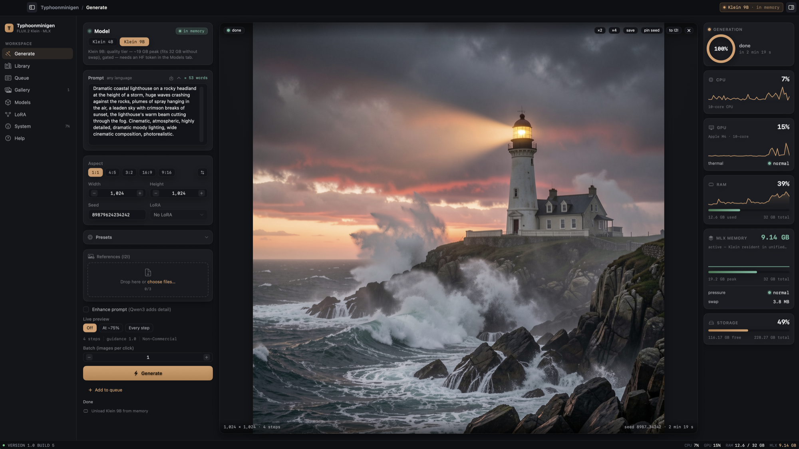
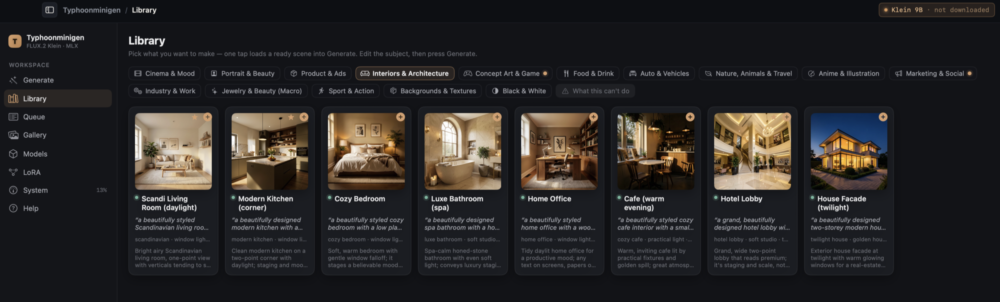
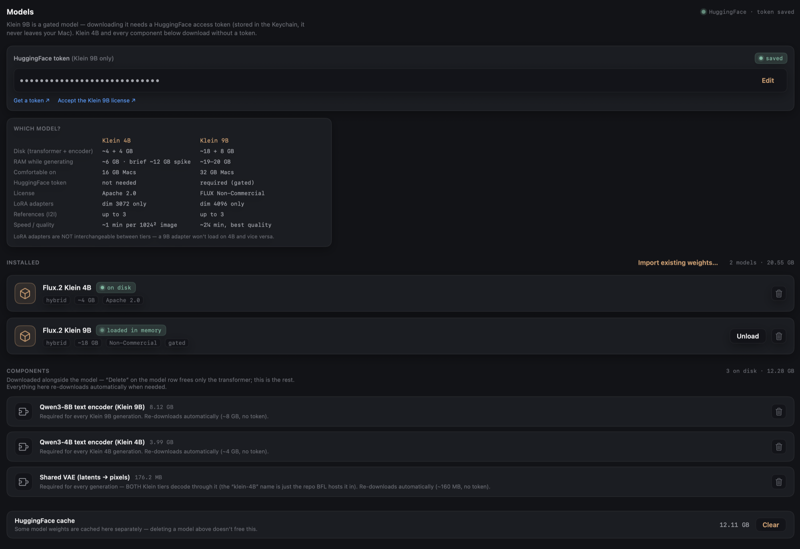
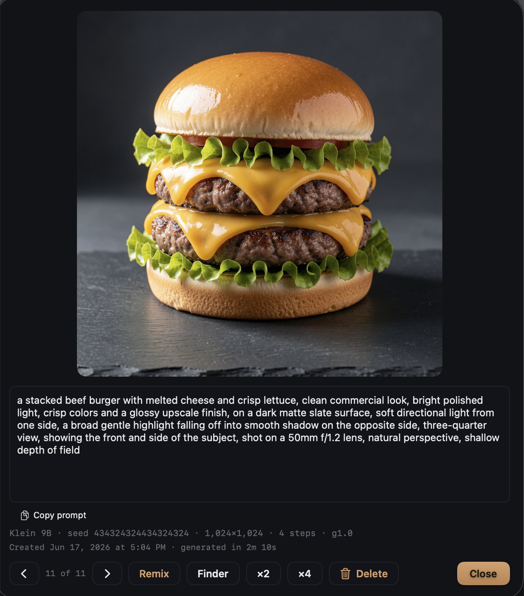

# Typhoonminigen

  [](LICENSE)   

A native macOS image generator for **FLUX.2 Klein**, running fully on-device on Apple Silicon
through **MLX** — no Python, no ComfyUI, no local server. Type a prompt (English **or** Russian),
press Generate, get an image. Reference images (image-to-image), LoRA adapters, a gallery with
reproducible recipes, and ×2/×4 upscaling are all built in.

> Not affiliated with SCB 10X's "Typhoon" LLMs or any other Typhoon-named project. "FLUX" is a
> trademark of Black Forest Labs; this is an independent client for it.



*Type a prompt in English or Russian, press Generate, and watch live system telemetry while Klein renders fully on-device.*

## Requirements

- **Apple Silicon Mac** (M1 or newer). Intel Macs are not supported (MLX is Apple-Silicon only).
- **macOS 14 (Sonoma) or newer.**
- **RAM:** 16 GB is comfortable for **Klein 4B**; **Klein 9B** wants **32 GB** (it peaks ~19–20 GB).
  The app picks a tier to match your RAM and warns before anything risks swapping.
  - **8 GB is not recommended.** The app runs (Klein 4B only, with output resolution auto-capped to ~896 px),
    but it leans on swap and is slow (~2 min/image), and memory-heavier paths — AI prompt enhancement or
    combining several reference images at once — can run out of memory. It won't harm your Mac, but don't
    expect comfortable work.
- **Disk:** ~10 GB for Klein 4B (transformer + encoder), ~28 GB for Klein 9B.

## Models

The app downloads model weights itself the first time you need them; nothing is bundled in this
repo. You accept each model's license under your own Hugging Face account.

| Tier | Params | Text encoder | License | Download |
|---|---|---|---|---|
| **Klein 4B** (default) | 4B | Qwen3-4B | Apache-2.0 | Tokenless — just press Download |
| **Klein 9B** | 9B | Qwen3-8B | FLUX.2 Klein \[Non-Commercial] License | Gated — needs a free HF token + license acceptance |

Both tiers share one VAE and Klein's fixed settings: **4 steps, guidance 1.0**. The Qwen3 encoder
understands **Russian prompts natively** — no translation needed.

## Install

### Option A — download a prebuilt app (easiest)

1. Download `Typhoonminigen.app` from the [Releases](../../releases) page.
2. macOS quarantines apps downloaded from the internet. Because this build isn't signed with a paid
   Apple Developer certificate yet, you have to clear that flag **once**. This is the standard way
   to run an unsigned open-source app — not a hack:

   **Easiest — Terminal (one line):**
   ```bash
   xattr -d com.apple.quarantine /path/to/Typhoonminigen.app
   ```
   (Drag the app onto the Terminal window to paste its path.)

   **Or — without Terminal:** double-click the app, let macOS refuse it, then open
   **System Settings → Privacy & Security**, scroll down, and click **“Open Anyway”** next to the
   Typhoonminigen message. Confirm once.

3. Open the app, go to the **Models** tab, and download a tier.

> Building it yourself? You don't need any of the above — locally built apps aren't quarantined.

### Option B — build from source

Requires **Xcode 26** with the **Metal Toolchain** (`xcodebuild -downloadComponent MetalToolchain`,
one-time, ~688 MB).

> **Build with `xcodebuild`, not `swift build`.** Plain SwiftPM can't compile MLX's Metal shaders,
> and the app would crash at runtime with `Failed to load the default metallib`.

```bash
git clone https://github.com/abgitdev/Typhoonminigen.git
cd Typhoonminigen
tools/bundle_app.sh Release          # builds + assembles ~/Desktop/Typhoonminigen.app
```

The first build compiles MLX (including Metal shaders) from source — that part is slow. The
dependency `mlx-swift` is pinned to `0.30.6` (0.31.4 breaks the engine's training code).

## What it does

- **Text-to-image** in English or Russian.
- **Image-to-image** — up to 3 reference images, optionally described for you by a small on-device
  vision model (Qwen3.5-VLM 4B).
- **LoRA adapters** — import `.safetensors`, automatic tier compatibility check, per-adapter trigger
  words, up to two fused at once.
- **Prompt presets** — curated, BFL-ordered phrase chips (camera, lighting, look…) plus your own.
- **Queue & batch** — render a series; you're notified when a long run finishes.
- **Gallery** — every image keeps its full recipe **inside the PNG**; drop one back on the canvas (or
  use “Remix”) to restore the exact settings.
- **Upscale** ×2/×4 via Real-ESRGAN.
- **Live system telemetry** — CPU / GPU / RAM / MLX memory / disk.
- **Model management** — download, import existing MLX weights, delete, unload to reclaim RAM.

## Screenshots

**Library — curated, ready-to-use scene presets across 11 categories.** One tap loads a complete scene into Generate; edit the subject and press Generate.



**Models — two quality tiers that match your RAM (Klein 4B / 9B), downloaded on-device.** The app picks a tier for your Mac and shows exactly what each one needs.



**Every image keeps its full recipe inside the PNG.** Open any result to copy the prompt, re-run it, or “Remix” the exact settings — seed, size, LoRA and all.



## Privacy

Everything runs locally. The app keeps no analytics and writes nothing to the macOS unified log.
Logs, the gallery index, and thumbnails all live under
`~/Library/Application Support/Typhoonminigen/` (and `~/Library/Caches/…`, `~/Library/Logs/…`) and
are erasable from the System tab. Your Hugging Face token is stored in the macOS **Keychain**; it is
sent only to huggingface.co to authenticate gated downloads.

## Uninstalling

The models and the HuggingFace download cache are several GB and live in your `~/Library` — **dragging
the app to the Trash does not remove them** (macOS can't clean up after a trashed app). To reclaim the
space, open **System → “Remove all data”** *before* deleting the app: one click wipes the models,
encoders, the HuggingFace cache, your gallery, LoRAs, presets, caches and logs. Then drag the app to the Trash.

## License

App code: **[MIT](LICENSE)**. Third-party components and model licenses:
**[THIRD_PARTY_LICENSES.md](THIRD_PARTY_LICENSES.md)**. Klein 4B is Apache-2.0 (commercial use OK);
**Klein 9B is non-commercial** under the FLUX.2 Klein license — using it is between you and Black
Forest Labs.

## Support

If this is useful to you, you can buy me a coffee — entirely optional, the app is free.

☕ **[ko-fi.com/abgitdev](https://ko-fi.com/abgitdev)**

## Credits

Built on [`flux-2-swift-mlx`](https://github.com/VincentGourbin/flux-2-swift-mlx) (the FLUX.2 MLX
engine) and [`mlx-swift`](https://github.com/ml-explore/mlx-swift). Models by
[Black Forest Labs](https://blackforestlabs.ai) (FLUX.2 Klein) and the Qwen team (text encoders);
upscaling by [Real-ESRGAN](https://github.com/xinntao/Real-ESRGAN).
